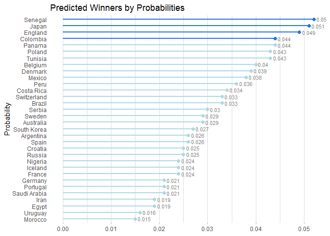
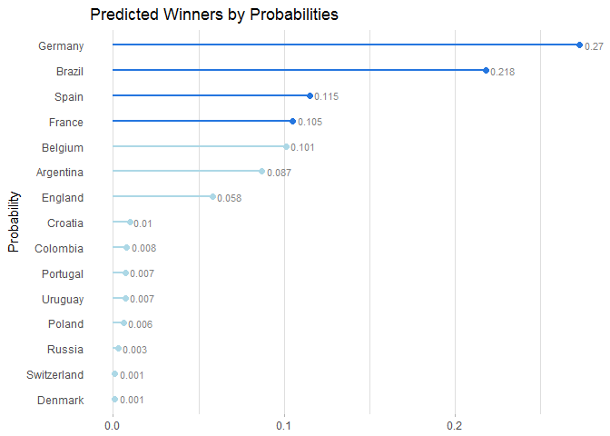
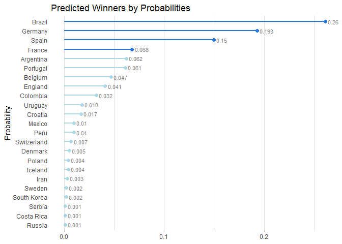
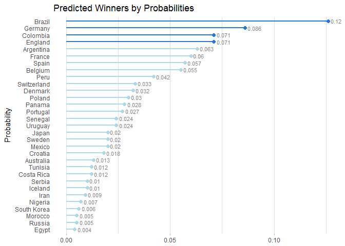
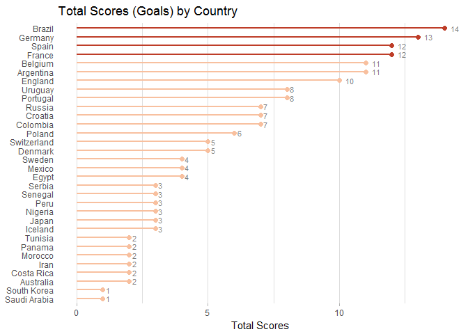
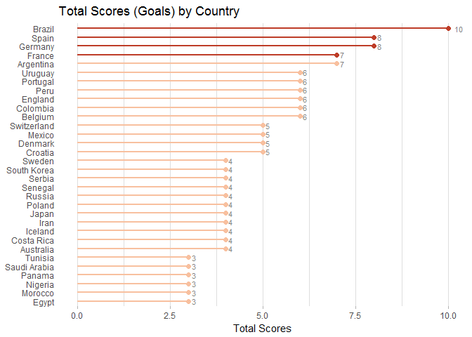

Another Prediction of FIFA World Cup 2018
================


The UEFA Champion League final a few weeks ago beteween Real Madrid and Liverpool was the only match I watched properly in over ten years. How dare I supposed to guess Brazil is going to lift the trophy in World Cup 2018? If you find the below dry to read, it is because of my limited natural language on the subject matter. Data science tricks to the rescue :)

> This blogpost is largely based on the prediction framework by an eRum 2018 talk from Claus Thorn Ekstrøm. For first hand materials please direct to [slides](http://www.biostatistics.dk/talks/eRum2018/#1), [video](https://www.youtube.com/watch?v=urJ1obHPsV8) and [code](github.com/ekstroem/socceR2018).

The idea is that in each simulation run of a tournament, we find team winner, runners-up, third and fourth etc. N times of simulation runs e.g. 10k returns a list of winners with highest probability to be ranked top.

Apart from the winner question, this blogpost seeks to answer which team will be top scorer and how many goals will they score. After following the Claus's analysis rmarkdown file, I collected new data, put functions in a package and tried another modelling approach. Whilst the model is too simplistic to be correct, it captures the trend and is a fair starting point to add complex layers on top.

Initialization
==============

The R code is written and shipped in the `dataMod.Rmd` R Markdown document. To reproduce the analysis, I would suggest that you download or clone the repository and run through [that doc](https://github.com/MangoTheCat/blog_worldcup2018/blob/master/dataMod.Rmd).

To begin with, we load packages including accompnying R package `worldcup` where my utility functions reside. Package is a convenient way to share code, seal utility functions and speed up iteration. Global parameters **normalgoals** (The average number of goals scored in a world cup match) and **nsim** (number of simulations) are declared in the YAML section at the top of `dataMod.Rmd`.

Next we load three datasets that have been tidied up from open source resource or updated from original version. Plenty of time was spent on gathering data, aligning team names and cleaning up features.

-   `team_data` contains features associated with team
-   `group_match_data` is match schedule, public
-   `wcmatches_train` is a processed dataset originated from [this Kaggle competetion](https://www.kaggle.com/abecklas/fifa-world-cup/data), can be used as training set to estimate parameter lamda i.e. the average goals scored in a match for a single team. Records from 1994 up to 2014 are kept in the training set.

``` r
library(tidyverse)
library(magrittr)
devtools::load_all("worldcup")

normalgoals <- params$normalgoals 
nsim <- params$nsim

data(team_data) 
data(group_match_data) 
data(wcmatches_train)
```

Play game
=========

Claus proposed three working models to calculate single match outcome. The first is based on two independent poisson distributions, where two teams are treated equal and so result is random regardless of their actual skills and talent. The second assumes the scoring event in a match are two possion events, the difference of two poisson events believed to have skellam distribution. The result turns out to be much more reliable as the parameters are estimated from actual bettings. The third one is based on [World Football ELO Ratings](https://www.eloratings.net/about) rules. From current ELO ratings, we calculate expected result of one side in a match. It can be seen as the probability of success in a binomial distribution. It seems that this approach overlooked draw due to the nature of binomial distribution i.e. binary.

The fourth model presented here is my first attempt. To spell out, we assumed two independent poisson events, with lambdas predicted from a trained poisson model. Then predicted goal are simulated by `rpois`.

Model candidate each has its own function, and it is specified by the **play\_fun** parameter and provided to higher level wrapper function `play_game`.

``` r
# Specify team Spain and Portugal
play_game(play_fun = "play_fun_simplest", 
          team1 = 7, team2 = 8, 
          musthavewinner=FALSE, normalgoals = normalgoals)
```

    ##      Agoals Bgoals
    ## [1,]      1      3

``` r
play_game(team_data = team_data, play_fun = "play_fun_skellam", 
          team1 = 7, team2 = 8, 
          musthavewinner=FALSE, normalgoals = normalgoals)
```

    ##      Agoals Bgoals
    ## [1,]      0      2

``` r
play_game(team_data = team_data, play_fun = "play_fun_elo", 
          team1 = 7, team2 = 8)
```

    ##      Agoals Bgoals
    ## [1,]      1      0

``` r
play_game(team_data = team_data, train_data = wcmatches_train, 
          play_fun = "play_fun_double_poisson", 
          team1 = 7, team2 = 8)
```

    ##      Agoals Bgoals
    ## [1,]      0      1

Estimate poisson mean from training
===================================

Let's have a quick look at the core of my training function. Target variable in the `glm` function is the number of goals a team obtained in a match. Predictors are FIFA and ELO ratings at a point before the 2014 tournament started. Both are popular ranking systems, difference being FIFA rating is official and the latter in the wild, adapted from chess ranking methodology.

``` r
mod <- glm(goals ~ elo + fifa_start, family = poisson(link = log), data = wcmatches_train)
broom::tidy(mod)
```

    ##          term      estimate    std.error  statistic      p.value
    ## 1 (Intercept) -3.5673415298 0.7934373236 -4.4960596 6.922433e-06
    ## 2         elo  0.0021479463 0.0005609247  3.8292949 1.285109e-04
    ## 3  fifa_start -0.0002296051 0.0003288228 -0.6982638 4.850123e-01

From the model summary, ELO rating is statistically significant whereas FIFA rating is not. More interesting is that the estimate for the FIFA ratings variable is negative, inferring the effect is 0.9997704 relative to average. Overall, FIFA rating appears to be less predictive to the goals one may score than ELO rating. One possible reason is that ratings in 2014 alone are collected, and it may be worth future effort to go into history. Chellenge to FIFA ratings' predictive power is not [new story](https://www.sbnation.com/soccer/2017/11/16/16666012/world-cup-2018-draw-elo-rankings-fifa) after all.

Training set **wcmatches\_train** has a **home** column, representing whether team X in match Y is home team. However, it's hard to say in a third country a team/away position makes much difference comparing to league competetions. Also I didn't find an explicit home/away split for Russian World Cup. We could derive a similar feature - host advantage, indicating host nation or continent in future model interation. Home advantage stands no better chance for the time being.

Group and kickout stages
========================

Presented below are examples to find winners at various stages, from group to round of 16, quarter-finals, semi-finals and final.

``` r
find_group_winners(team_data = team_data, 
                   group_match_data = group_match_data, 
                   play_fun = "play_fun_double_poisson",
                   train_data = wcmatches_train)$goals %>% 
  filter(groupRank %in% c(1,2)) %>% collect()
```

    ## # A tibble: 16 x 11
    ##    number name        group rating   elo fifa_start points goalsFore
    ##     <int> <chr>       <chr>  <dbl> <dbl>      <dbl>  <dbl>     <int>
    ##  1      1 Egypt       A      151    1646        636      7         7
    ##  2      2 Russia      A       41    1685        493      4         4
    ##  3      6 Morocco     B      501    1711        681      6         2
    ##  4      8 Spain       B        7    2048       1162      6         7
    ##  5     11 France      C        7.5  1984       1166      9         9
    ##  6     12 Peru        C      201    1906       1106      4         5
    ##  7     14 Croatia     D       34    1853        975      7         7
    ##  8     16 Nigeria     D      201    1699        635      4         4
    ##  9     17 Brazil      E        5    2131       1384      6         6
    ## 10     19 Switzerland E      101    1879       1179      6         4
    ## 11     21 Germany     F        5.5  2092       1544      9         5
    ## 12     22 South Korea F      751    1746        520      6         3
    ## 13     25 Belgium     G       12    1931       1346      6         6
    ## 14     27 Panama      G     1001    1669        574      4         4
    ## 15     30 Japan       H      301    1693        528      5         2
    ## 16     32 Senegal     H      201    1747        825      4         5
    ## # ... with 3 more variables: goalsAgainst <int>, goalsDifference <int>,
    ## #   groupRank <int>

``` r
find_knockout_winners(team_data = team_data, 
                      match_data = structure(c(3L, 8L, 10L, 13L), .Dim = c(2L, 2L)), 
                      play_fun = "play_fun_double_poisson",
                      train_data = wcmatches_train)$goals
```

    ##   team1 team2 goals1 goals2
    ## 1     3    10      0      4
    ## 2     8    13      1      1

Run the tournament
==================

Here comes to the most exciting part. We made a function `simulate_one()` to play tournament one time and then `replicate()` (literally) it many many times. To run an ideal number of simulations for example 10k, you might want to turn on parallel. I am staying at 1000 for simplicity.

Finally, `simulate_tournament()` is an ultimate wrapper for all the above bullet points. The returned `resultX` object is a 32 by `R params$nsim` matrix, each row representing predicted rankings per simulation. `set.seed()` is here to insure result of this blogpost is reproducible.

``` r
# Run nsim number of times world cup tournament
set.seed(000)
result <- simulate_tournament(nsim = nsim, play_fun = "play_fun_simplest") 
result2 <- simulate_tournament(nsim = nsim, play_fun = "play_fun_skellam")
result3 <- simulate_tournament(nsim = nsim, play_fun = "play_fun_elo")
result4 <- simulate_tournament(nsim = nsim, play_fun = "play_fun_double_poisson", train_data = wcmatches_train)
```

Get winner list
===============

`get_winner()` reports a winner list who has highest probability. Apart from the random poison model, Brazil is clearly the winner in three other models. Top two teams are between Brazil, Germany. With different seeds, the third and fourth places (in darker blue) in my model are more likely to change. Variance might be an interesting point to look at.

``` r
get_winner(result) %>% plot_winner()
```



``` r
get_winner(result2) %>% plot_winner()
```



``` r
get_winner(result3) %>% plot_winner()
```



``` r
get_winner(result4) %>% plot_winner()
```



Who will be top scoring team?
=============================

The skellum model seems more reliable, my double poisson model gives systematically lower scoring frequency than probable actuals. They both favours Brazil though.

``` r
get_top_scorer(nsim = nsim, result_data = result2) %>% plot_top_scorer()
```



``` r
get_top_scorer(nsim = nsim, result_data = result4) %>% plot_top_scorer()
```



Conclusion
==========

The framework is pretty clear, all you need is to customise the `play_game` function such as `game_fun_simplest`, `game_fun_skellam` and `game_fun_elo`.

Tick-tock... Don't hesitate to send a pull request to [ekstroem/socceR2018](github.com/ekstroem/socceR2018) on GitHub. Who is winning the guessing-who-wins-worldcup2018 game?

Notes
=====

1.  Data collectin. I didn't get to feed models with most updated betting odds and ELO ratings in the **team\_data** dataset. If you would like to, they are available on the below three sources. FIFA rating is the easiest, can be scraped by rvest in the usual way. The ELO ratings and betting odds tables seem to have been rendered by javascript and I haven't found a working solution. For betting information, Betfair, an online betting exchange has an API and R package [`abettor`](https://github.com/phillc73/abettor) helps to pull those odds which are definetly interesting for anyone who are after strategy beyond predction.

-   <https://www.betfair.com/sport/football>
-   <https://www.eloratings.net/2018_World_Cup>
-   <http://www.fifa.com/fifa-world-ranking/ranking-table/men/index.html>

1.  Model enhancement. This is probably where it matters most. For example, previous research have suggested various bivariate poissons for football predictions.

2.  Feature engineering. Economic factors such as national GDP, market information like total player value or insurance value and player injure data may be useful to improve accuracy.

3.  Model evaluation. One way to understand if our model has good prediction capibility or not is to evaluate the predictions against actual outcomes after 15 July 2018. Current odds from bookies can also be referred to. It is not imporssible to run the whole thing on historical data e.g. Year 2014. and perform model selection and tuning.

4.  Functions and package could be better parameterized; code to be tidy up.
